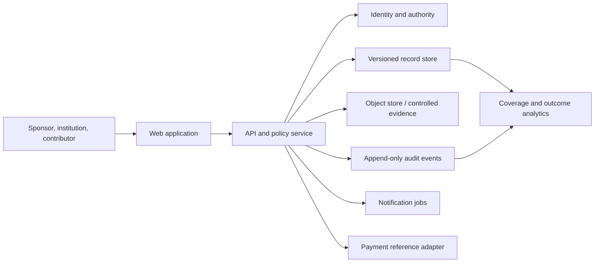
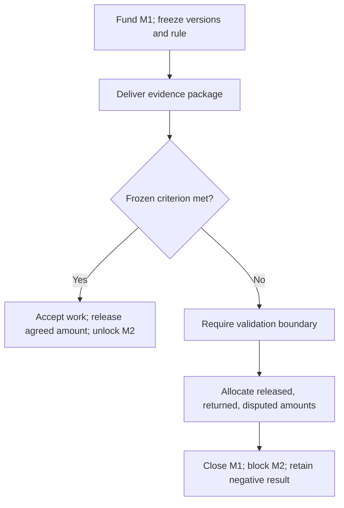

# Anusandhan Setu — system architecture v0.1

## Design rule

`schema/src/schema.ts` is the canonical domain contract. The current React types are a presentation subset and must eventually be generated from a runtime-validated API schema, not maintained independently.

## Logical components

The platform records payment commitments, references and allocation. Custody/escrow is out of scope until a regulated provider and counsel-approved flow are chosen.

## Bounded contexts

- **Authority:** people, organisations, institutions, verified roles and signing authority.
- **Records:** briefs, assets, evidence, boundaries, versions and provenance.
- **Rights:** contributor declarations, ownership decisions, disclosure states and policies relied upon.
- **Matching:** requirement coverage and curator rationale; deterministic evidence, not a single opaque score.
- **Engagement:** frozen next step, milestones, sponsor inputs, reviewer outcomes, failure closure and payment allocation.
- **Evidence access:** object metadata, classification, grants, expiry and access audit.
- **Analytics:** derived read models; never the transaction source of truth.

## State and event model

Commands validate authority and invariants, write a new immutable version/event, then update read models. Critical events include `brief.accepted`, `asset.disclosure_cleared`, `match.reviewed`, `milestone.funded`, `criterion.recorded`, `boundary.published`, `payment.allocated`, and `engagement.closed`.

No destructive edit changes a version relied on by a counterparty. Corrections append a superseding version with reason and actor.

## Failure transaction

The reviewer decides the technical criterion. Contract terms decide payment. The platform checks completeness and arithmetic; it does not silently turn technical failure into non-payment.

## Core invariants

1. `public_cleared` and `nda_only` decisions name the institution authority and record version.
2. Fundable steps have price basis, quote owner/date, duration, sponsor inputs, pre-registered criterion and failure meaning.
3. Funding freezes referenced versions and the acceptance/failure rule.
4. A failed criterion requires a non-empty boundary and evidence reference.
5. Released + returned + disputed equals committed minor units.
6. Later coverage cannot claim a condition excluded by an accepted boundary without new superseding evidence.
7. Every sensitive-object open has actor, purpose, grant, timestamp and outcome.

## Suggested implementation

- TypeScript API with runtime schema validation generated alongside client types.
- PostgreSQL for relational records, versions, grants and payment references; append-only audit table with restricted update/delete privileges.
- S3-compatible encrypted object storage; short-lived signed URLs after policy checks.
- Background job queue for SLA reminders, access expiry and notifications.
- OIDC identity with MFA for rights authorities and sponsor decision owners; role plus record-scoped grants.
- Observability with structured logs, request/trace IDs, policy-decision metrics and redaction at ingestion.

Exact cloud/vendor choices remain open until institution requirements, India data-location needs, cost and procurement constraints are known.

## Security and privacy boundaries

- Public metadata, public evidence, NDA-only evidence and restricted personal/operational data are separate classifications.
- Metadata never leaks confidential filenames, access recipients or private assertions.
- Production data is denied from demo environments.
- Malware scan, content-type verification and checksum occur before evidence becomes available.
- Secrets live in a managed secret store; no credentials in repository or client bundle.
- Tenant-aware authorization is enforced server-side on every object and record operation.

## Deployment path

1. Alpha: static UI with demonstration data and no real secrets or money.
2. Controlled pilot: authenticated API, one database, private evidence store, manual contracting/payment references.
3. Production candidate: isolated environments, tested backups, security/privacy review, incident playbooks and regulated payment adapter if required.
